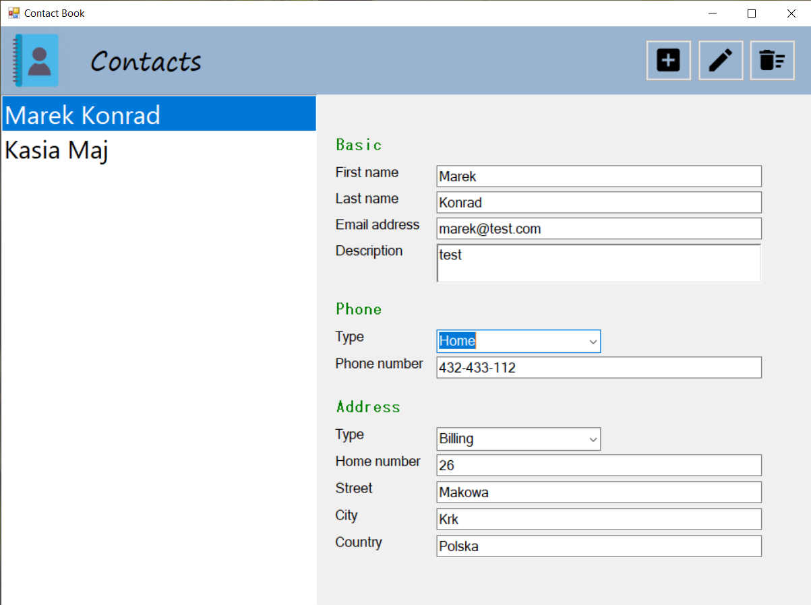

<h1 align="center">Contact Book</h1>

<p align="center">


</p>

## About The Project

_The application was created for [Programming IV](https://www.wbmii.ath.bielsko.pl) classes.
The project implements MVP pattern and transactions with Dapper._

<br/>

<p align="center">
  
</p>

## Features

- CRUD operations

## Built With

- [WinForms](https://docs.microsoft.com/en-us/dotnet/framework/winforms/) .NET Framework 4.8
- [Dapper](https://dapper-tutorial.net/)

## Getting Started

### Prerequisites

- .NET Framework 4.8
- SQL Server

### Installation

1. In solution CBData/PublishLocations create `publish.xml` file. Right click on project -> Publish ->
   Edit -> Browse -> Local -> select MSSQLLocalDB. Enter Database name: CBData. Clik Save Profile AS and select PublishLocations folder. Publish.

2. In solution CBDesktopUI in `App.config` set your database connection string.

```JSON
 <connectionStrings>
    <add name="CBData" connectionString="ENTER YOUR CONNECTION STRING" />
  </connectionStrings>
```

3. In tables AddressType and PhoneNumberType enter any data.

4. Build and run the solution.

## License

This project is licensed under the MIT License.

## Contact

**Krzysztof Talar** - [Linkedin](https://www.linkedin.com/in/ktalar/) - krzysztoftalar@protonmail.com
